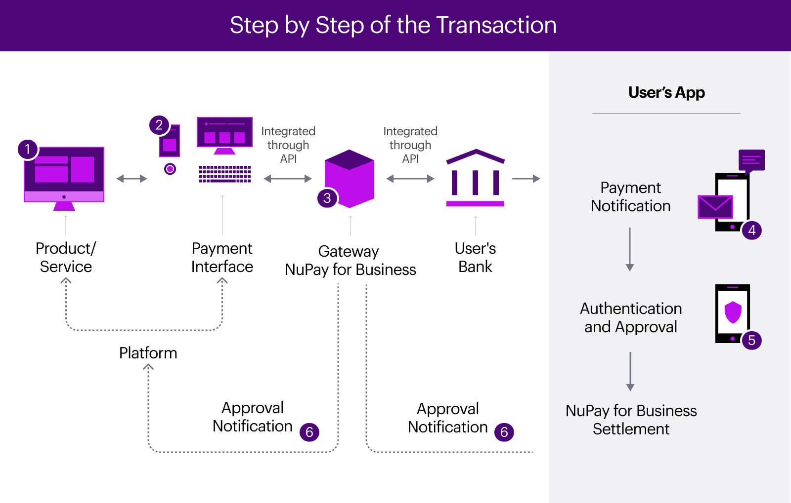

# Introduction
**NuPay for Business** offers instant payment service solutions to retail that allows the democratization of shopping to brazilian consumers with innovation and agility.

This document aims to set the developer in the process of integrating into **NuPay for Business**' service, describing the concepts, functionalities and protocols of information exchange in the platform.

The image below exemplifies a summary flow of an online payment for a product or service initiated by a Consumer, directly on the merchant's platform, and checkout of payment by two methods: **Pix**, through debit on the account of the financial institution chosen; or via credit and debit solutions through **NuPay**.

**Pix** is an instant payment solution created by the Central Bank of Brazil to make the transference of resources between accounts in a couple of seconds, any day, any time.

**NuPay** is **NuPay for Business**' exclusive payment method, that was born with the purpose of causing disruption inside the online payment method ecosystem, and part of that is due to our UX. With **NuPay**, the customers can choose debit or credit as payment type directly through Nubank's app, without having to type any data or information directly.

To learn more about **NuPay**'s final user experience, click [here](lalala) (document in brazilian portuguese)

The flow can be divided, in a simplified way, into the steps described below:

1. **Product / service Acquisition**: Consumer meets all requirements determined by the merchant before checkout, if required, such as logging into the account on the platform or creating an account and making an online purchase of a product or service on the merchant's online sales platform.
2. **Payment of the purchased product / service**: Consumer determines payment of your purchase through NuPay for Business.
3. **Transaction processing**: The order is then processed in such a way that the selected financial institution is notified via API. It performs the identification of the Consumer's account and, if found, executes its initial analyses for the acceptance of the processing.
4. **Payment notification**: If the payment processing is accepted, the Consumer is notified through the financial institution's app on the mobile device linked to their account.
5. **Authentication and approval**: The Consumer verifies the purchase information and authorizes performing appropriate security procedures specified by the financial institution. If the transaction is authorized, the purchase amount is debited from the Consumer's account and is transferred to the merchant’s checking account at NuPay for Business.
6. **Notification of approval and completion of the transaction**: If the transaction is successfully carried out, the parties are notified, the purchase is considered as paid and the amount is settled to the merchant.

-------
# Using the NuPay for Business
To use NuPay for Business, some previous steps are required:

- Merchant's registration data
- Merchant credentials
- Integration of the merchant platform with the NuPay for Business APIs

## Registration data
During the onboarding process, some information and documents will be requested by the commercial department in order to register the merchant for the use of NuPay for Business, such as company name, corporate name, CNPJ, responsible data, among others.

Account information in financial institutions is also required for payments to be received.

## Credentials
In order to authenticate and authorize requests to the NuPay for Business API, a pair of credentials will be provided, specific for each merchant and each Checkout environment (testing and production).

These credentials will be provided during the onboarding process, once both parties are able to initiate integration and must be sent on all requests.

Each credential has the concept of permission, which helps to limit the access scopes. The first one is the Payment Permission, that authorizes calls to the payments and refunds flow, and the second one is the Conciliation Permission, that authorizes calls to the conciliation API.

## Documentation for merchants
- [Version 1.4](docs/text-0002.md)

## Glossary
- **Consumer**: user of the merchant system, whether he is in e-commerce and / or mobile commerce, who is making an online purchase.
- **Account**: consumer account at the financial institution. Accounts can be of various types, such as checking accounts, savings accounts, payment accounts, etc.
- **Payment**: process of transferring funds between the paying consumer and the receiving merchant.
- **Merchant**: verified shopkeeper able to receive payments for online purchases via NuPay for Business.