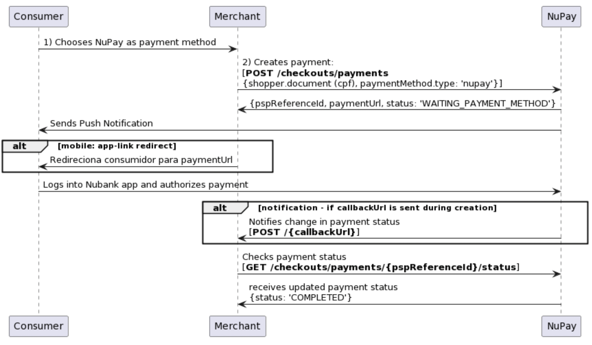

# Merchants
Any questions, feedbacks or request for additional information, send an email to [integration-nupay@nubank.com.br].
___
# Documentation APIs
- [API docs v1.4]()
- [Sandbox environment]()

## Notice on updates
Your store's integration with the systems needs to be implemented in a way that supports backward compatibility with support for:

- Addition of new endpoints;
- Addition of new optional parameters on existing endpoints;
- Addition of new fields in the response body of existing endpoints;
- Addition of new elements on enumerations;
- Changing the order of fields.
The changes mentioned above are possible and expected due to the product's evolution. It is highly recommended that your store's implementation is prepared to accommodate these additions without disrupting the flow of the existing integration. To handle potential additions, it is necessary for unexpected fields in JSON structures to be simply ignored rather than rejected by your store's implementation.

Any changes that are not backward-compatible will be released in a new version of the API and the clients will be warned about the need to rollout to the new version.
___
# Adding Pix and NuPay in your e-commerce
To make Pix and NuPay available at your e-commerce, you will have to develop what we call the **Transparent Flow**, except for VTEX stores. To activate NuPay on VTEX, see [this guide]().

The user experience is due to the merchant development, so as the user progresses on the payment journey, the order status is updated and informed to the merchant system, and it is up to the merchant to personalize the payment experience on the platform.

## Pix and NuPay as payment methods
The first step is to add Pix and NuPay as payment method in your checkout page as shown by the following image. You can customize the payment methods to follow your site's user experience patterns and guidelines, but please be aware of [Nubank's brand guide recommendations]() and [Pix's brand guide recommendations]().

If needed, to assist in the presentation of payment methods you can use the [GET Payment methods endpoint](). It returns the payment methods available to the merchant as previously agreed in the contract between merchant and NuPay for Business. In the example above, for example, two groups were returned: `Pix` and `NuPay` (Nubank).

If Pix is chosen as payment method by the customer, your e-commerce must provide the QR Code or the Pix Copia e Cola (specially for mobile experiences) as described below (with the proper creation of the payment request done earlier via [POST Create Payment]()).

If NuPay is chosen as payment method, you must redirect the customer to Nubank's app to complete the payment after finishing the purchase in your e-commerce.

### Pix
When Pix is enabled as payment method for your store, GET Payment methods will return Pix as a new payment method as an element in the paymentMethods attribute.

#### Presenting Pix QR Code or Pix Copia e Cola
The Pix experience must follow the specification below:

###### Desktop experience
The QRCode's image should be obtained from an URL built with the information returned by `schemas.qrCode` field from the [GET Payment methods]() request, together with the identifier of the payment order (`pspReferenceId` - returned by the [payment creation request]()) and the `type` of the payment method Pix.

###### Mobile experience
The Pix recommended experience for mobile platforms is Pix Copia e Cola, a code represented by the content of the QR Code of that payment, which must be copied by the user and used in the paying bank's app (in the paying with Pix section) to finish the purchase.

This code should be obtained from the URL built with the information returned by `schemas.qrCodeContent` field, acquired in the [GET Payment methods]() request, together with the payment order identifier and the `type` of the payment method Pix, as exemplified in our [technical documentation]().

> Pix Copia e Cola is not the same thing as the "chaves Pix", which is another way to initiate a Pix. NuPay for Business only accept Pix payments made either with QR Code or Pix Copia e Cola.
----
### NuPay
#### Making NuPay available as payment method in your integration
When NuPay is active as payment method for your store, [GET Payment methods] will return NuPay as a new `payment method` as an element of the paymentMethods attribute.

#### Payment Order Creation
You must use the [POST Payment order]() API specifying `nupay` (returned on available payment methods) in the `paymentMethod.type attribute`.

As soon as the NuPay payment is created, the consumer associated with the CPF will receive a payment notification from Nubank's app. The payment creation also returns the created payment's identification as `pspReferenceId`, as well as a `paymentUrl` that's an Universal Link (AppLink) which can be utilized in mobile devices to redirect the user directly to Nubank's app to authorize the payment.

This service should be called when the customer demonstrates payment intent via NuPay and the goods/services are ready to be paid, because as soon as the payment is created, the notification is triggered and the expiration timer starts ticking.

Also, this service can return the payment created with a `CANCELLED` status when it's not possible to process the payment, such as when the informed CPF on payment creation is not from a Nubank's customer.
---
# Conciliation
[Check here for more details]()
----
# Refund
[Check here for more details]()
----
# Merchant's dashboard
[Check here for more details]()
---
> [!NOTE|label:Confidentiality]
> THIS DOCUMENT IS PROVIDED EXCLUSIVELY TO MERCHANTS AUTHORIZED IN THE CONTEXT OF EVALUATION, PLANNING AND REFERENCE OF SYSTEM INTEGRATIONS BETWEEN THE PARTIES. THE MATERIAL INCLUDES INFORMATION, CONCEPTS AND STATEMENTS WHICH MAY BE SUBJECT TO COPYRIGHT OR OTHER FORMS OF PROTECTION TO INTELLECTUAL PROPERTY. NO PART OF THIS DOCUMENT MAY BE DISTRIBUTED OR USED IN ANY WAY NOT DESCRIBED HEREIN, EXCEPT PRIOR WRITTEN CONSENT TO NUPAY FOR BUSINESS.